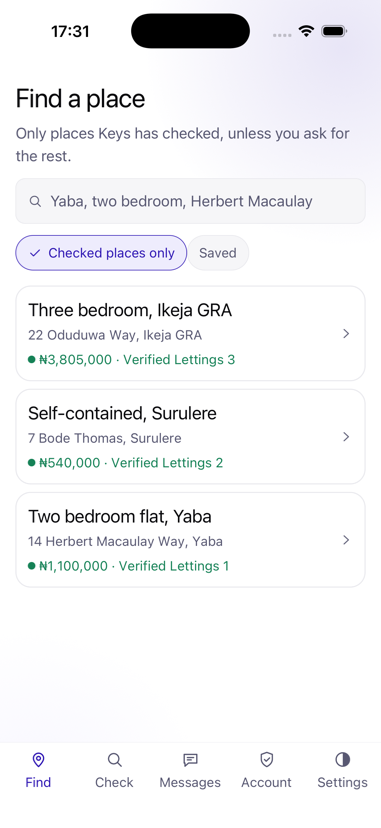
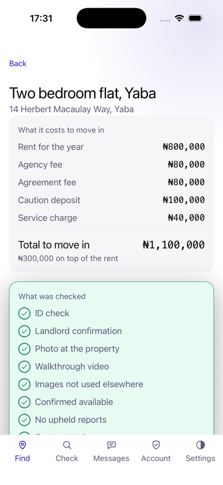
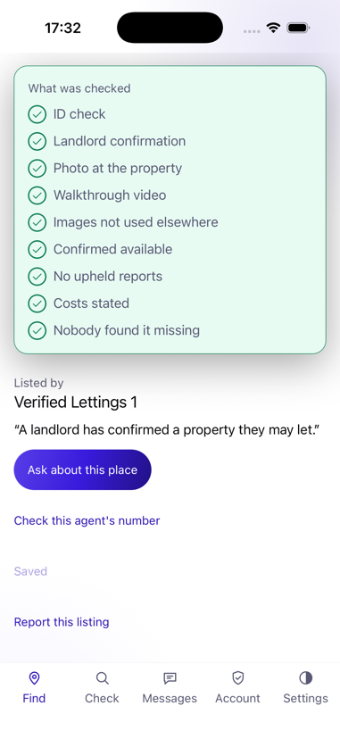
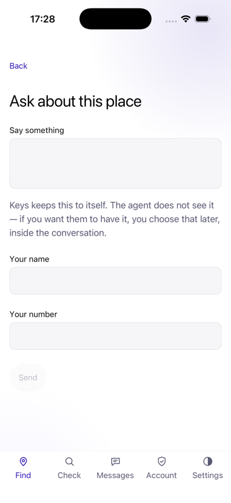
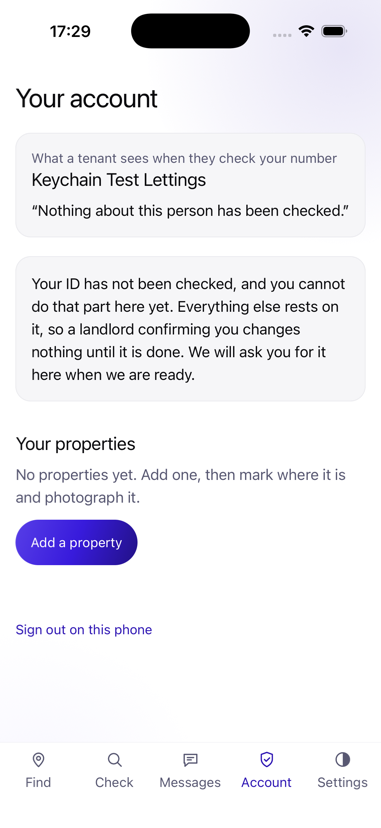
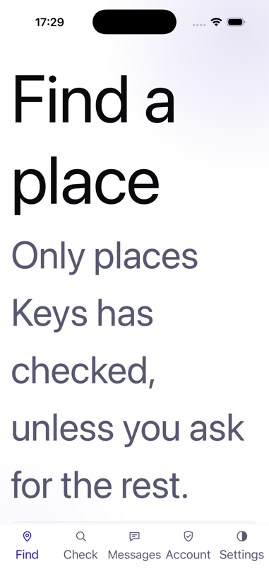

# Keys

**Verified rental listings and tenancy management for Nigerian cities.**

Finding a place to rent in Lagos, Abuja or Port Harcourt costs money before it costs rent. You see
a listing, you call, you pay an inspection fee — and then the property does not exist, or was let
three months ago, or the person showing it has no authority to let it. You have spent ₦10,000 and
half a day. You repeat this ten times.

The inspection fee is not a cost of finding a house. For a meaningful number of operators, **it is
the entire business model** — because the fee is collected before the property is seen.

Keys attacks one thing first — *the listing is real* — and then follows the tenant into the
tenancy.

See [`docs/00-PRODUCT-STATEMENT.md`](docs/00-PRODUCT-STATEMENT.md) for the full analysis.

---

## What it looks like

| | | |
|:--:|:--:|:--:|
|  |  |  |
| **Find a place** — checked places only by default, priced by what it costs to *move in* rather than the advertised rent | **What it costs** — ₦800,000 advertised, ₦1,100,000 to move in. The gap is never added up anywhere else | **What was checked** — nine conditions, ticked or not, recomputed on this request from evidence |
|  |  |  |
| **Asking** — the account is part of the question, not a gate in front of it. Keys holds both numbers back until each side offers | **The agent's side** — what a tenant sees when they check this number, then the properties | **At the largest text size** — checked rather than assumed, which is what found three broken layouts |

The full deck, with the reasoning under each screen, is
[`docs/Keys-screens.pdf`](docs/Keys-screens.pdf).

---

## Status

**Phase 6 of 8 — launch hardening.** `PHASE` holds the number,
[`docs/ROADMAP.md`](docs/ROADMAP.md) holds the phase gates, and
[`docs/V1-SCOPE.md`](docs/V1-SCOPE.md) says what v1.0 is.

**Nothing is deployed, and five gates block v1.0** — every one of them needs a
physical device or a person, not more code. See
[`docs/RELEASE-GATES.md`](docs/RELEASE-GATES.md).

| | |
|---|---|
| Mobile | React Native 0.87, New Architecture, TypeScript strict |
| Web | Next.js 15 with SSR — the registry surface. The marketplace is mobile |
| Server | **NestJS 11 on Node 22**, importing the same rules the phone runs |
| Data | PostgreSQL 16 — durable, with the publication rule as `CHECK` constraints. **No PostGIS**, deliberately: `ST_DWithin` would be a second implementation of distance ([ADR-0008](docs/adr/0008-sql-narrows-the-domain-decides.md)) |
| Rules | `packages/domain`, pure TypeScript, three consumers, [Apache-2.0](packages/domain/LICENSE) |
| Wire | `packages/api`, generated from the controllers, [gated against drift](scripts/api-fresh.sh) |
| Languages | English, Hausa, Yoruba and Igbo, in every string the app renders |

**There is no parity suite here, and that is the point.** The last project in
this portfolio had a C# server mirroring a TypeScript domain, held together by
generated fixtures. This one imports the domain, so a rule cannot drift because
there is only one of it. See
[ADR-0001](docs/adr/0001-the-server-imports-the-domain-rather-than-mirroring-it.md).

### What works end to end

Run the server and the app (below) and you can, right now:

**As a tenant**

- **Find a place.** Search narrows in SQL and the domain decides — Verified
  first, checked places only unless you ask otherwise, each row priced by what
  it costs to move in.
- **Read what was checked.** Nine conditions, ticked or not, in your language,
  computed on the request from evidence. Not a badge: the list you can disagree
  with.
- **Ask the agent, without giving them your number.** Keys holds both back until
  each side offers theirs. A message with a number in it is refused rather than
  quietly stripped.
- **Arrange a viewing at a fee named in advance**, then say what happened. *There
  was nothing there* takes the badge off the listing on the very next search.
- **Save a place and read it with no signal.** It never shows the badge — not
  even for a copy saved thirty seconds ago — because a phone with no signal has
  checked nothing.
- **Check or report a number**, and report a listing without knowing whose it is.

**As an agent**

- Open an account, draft a property, mark where it is, photograph and film it in
  the app — signed by a key the phone cannot export — state what it costs, and
  publish only what a landlord has confirmed.
- Every upload says what it will cost in data before it spends it.

**As a reviewer**

- The queue, one report at a time, with no way to decide without naming yourself
  and saying why. Identity checks and landlord confirmations done by hand, which
  is how v1.0 ships without a KYC vendor or an SMS provider.

### What is not built

Named here rather than left to be discovered. Each is a
[release gate](docs/RELEASE-GATES.md) with a number.

- **There is no photograph anywhere in this product** (R11, R14). A capture is a
  40×32 greyscale grid — enough for a perceptual hash, enough for every gate
  here to pass, and not enough to look at the flat. The server accepts real media
  and binds it into the signature; the camera does not yet produce any.
- **Android is unverified** (R4, R16). iOS compiles and runs; Android has never
  been built on this machine, and its session tokens have nowhere safe to live,
  so it refuses to open an account at all rather than keeping one in a file.
- **No SMS provider** (R7, R12), so landlord confirmation is a telephone call a
  reviewer makes. The outbox holds only a phone *hash*, so no message in this
  product can currently be delivered to anybody.
- **No KYC vendor** (R6, closed by hand), **no payment provider** (R13), **no
  object-storage bucket** (R15).
- **No legal review** (R3). It blocks publishing reports about named people,
  which is why that is out of v1.0 entirely. No test result substitutes for it.

### Running it

```bash
make setup                 # pnpm install, the local databases, and the git
                           # hooks — once
make ci                    # every gate: typecheck, lint, boundary, docs,
                           # wired, untranslated, api-fresh, and the tests
```

`make setup` points git at `.githooks`, so `make ci` runs before every push.
`--no-verify` skips it, deliberately: a hook that cannot be skipped is a hook
people delete.

The server, with a reviewer token long enough for the guard to accept:

```bash
KEYS_REVIEWER_TOKEN=$(openssl rand -hex 24) PORT=5211 pnpm --filter @keys/server start
```

Without `KEYS_DATABASE_URL` it starts on an in-memory store and says so —
`/healthz` answers `durable: false`. That fallback announces itself rather than
defaulting the other way, because a server that quietly loses every report on
restart while every log line looks normal is worse than one that will not start.

```bash
make db     # createdb keys_test and keys_dev, once
KEYS_DATABASE_URL="postgres://$USER@localhost/keys_dev" \
KEYS_REVIEWER_TOKEN=$(openssl rand -hex 24) PORT=5211 \
  pnpm --filter @keys/server start
```

The app, once per machine, for iOS:

```bash
cd apps/mobile/ios && LANG=en_US.UTF-8 pod install
```

The locale matters: CocoaPods 1.16 on Ruby 4 raises `Encoding::CompatibilityError`
without a UTF-8 locale, and the error names Unicode normalisation rather than
anything you did.

The web surface, pointed at it:

```bash
KEYS_API_URL=http://127.0.0.1:5211 pnpm --filter @keys/web dev
```

`KEYS_API_URL` has no localhost fallback, deliberately: a production build
silently pointing at somebody's laptop is worse than one that refuses to start.

### Configuration

Every one of these changes what the server will *refuse* to do, which is why
they are listed together rather than left in whichever file reads them.

| Variable | Read by | Unset means |
|---|---|---|
| `KEYS_DATABASE_URL` | server | In-memory store. Announced: `/healthz` says `durable: false` |
| `KEYS_REVIEWERS` | server | `name:token,name:token`. Resolves a token to the reviewer who holds it, so every audit row names a person |
| `KEYS_REVIEWER_TOKEN` | server | The older single-token form. Works, and resolves to a reviewer called `unattributed`. With neither set **the console refuses everybody** — an unconfigured server has no console, not an open one. Tokens shorter than 32 characters are refused |
| `KEYS_CORS_ORIGINS` | server | No browser may call the API. `*` is rejected at startup — the process will not boot |
| `KEYS_API_URL` | web | **The web surface will not start.** There is no localhost fallback: a production build silently pointing at somebody's laptop is worse than one that refuses |
| `KEYS_TEST_DATABASE_URL` | tests | Server suites run against the in-memory store only, and `make test` prints a warning saying so |

Each default is the one that fails loudly. That is the pattern, not a
coincidence: a missing secret should stop the thing that needs it, never quietly
widen what is allowed.

### The gates

`make ci` runs eleven of them, and every one has been **proved to fail** by
breaking what it guards and watching it go red:

| Gate | Holds |
|---|---|
| `typecheck` | Four packages, TypeScript strict, `exactOptionalPropertyTypes` |
| `lint` | ESLint across every package |
| `boundary` | `packages/domain` imports nothing platform-specific |
| `doc-check` | Required documents exist, are tracked, and the roadmap marks the phase `PHASE` says |
| `wired-check` | Nothing is exported, tested, and called by nothing |
| `untranslated` | No English string is rendered by a screen without going through `say()` |
| `api-fresh` | The generated client still matches the controllers |
| `bundle-check` | **The app actually bundles**, and all four languages are in the artefact a device runs |
| `splash-check` | The native launch screen and the JavaScript splash are the same colour, so a cold start does not flash |
| `mark-check` | The app and the web draw the same mark, to the path |
| `test` | 85 across the four packages: 34 domain, 45 server, 4 wire, 2 app |

The server suites run **against every store implementation** — in memory and
Postgres — because a suite that only exercises the `Map` proves something about
a `Map`. `make test` finds a database if one is reachable and says plainly when
it cannot, rather than passing quietly on half the coverage.

Three of these could not fail when phase 1 began — they were ported from the
previous project and were scanning directories that do not exist here, or
returning zero unconditionally. That is written up in
[ADR-0004](docs/adr/0004-a-gate-that-cannot-fail-is-not-a-gate.md), and every
gate now fails when it examines nothing.

## The insight

**The scarce commodity is not listings. It is the belief that a listing is real.**

Nigerian property portals have enormous inventory and near-zero trust. Adding more listings adds
nothing. The whole opportunity is making a *smaller, verified* inventory credible — and the honest
consequence is that Keys launches with far fewer listings than the incumbents and must be
comfortable with that.

The mechanism is inverting the incentive on inspection fees. Keys takes no cut of them, so a
listing that generates fees without ever producing a let is worthless to Keys and profitable to a
portal.

## The wedge

**A free, public, no-account scam registry.** Paste a phone number and find out whether it has
been reported. That is useful on day one to someone who found the property on Facebook, with zero
listings and zero agents on the platform.

It also solves the hardest problem in a two-sided property marketplace: agents come to Keys to
*defend a clean record*, so onboarding is partly self-driven rather than entirely sales-driven.

## Does it need a backend?

**Yes — the most backend-dependent in the portfolio.** Everything Keys sells is a *judgement about
someone else's claim*: is this listing verified, is this photograph already in use elsewhere, did
this capture happen at the property, may this agent let it, should this scam report be public.
None of that can be decided anywhere a client can reach.

Unusually, a **human-review console is a first-class product surface**, and its throughput is a
hard constraint on how fast the company can grow. Keys expands city by city at the pace the review
queue can sustain.

## How a listing is verified

[Nine conditions](packages/domain/src/listings.ts), and the badge is the
statement that every one of them holds. It is computed on every read — there is
no `is_verified` column — so a listing that loses one is gone from the *very
next* search rather than the next sweep.

Six independent mechanisms behind them, so defeating one does not defeat the
system:

1. **Geotagged on-device capture** — a photo *and* a walkthrough taken in-app,
   within 200 m of the stated address, signed by a key the phone cannot export
   and verified server-side. EXIF is not trusted; it is trivially forged.
2. **Perceptual hashing** — every image compared against every image ever
   uploaded, across agents, cities and time. Recycled photographs are the
   signature of a fake listing.
3. **Proof of authority** — a landlord confirms the agent. At v1.0 that is a
   reviewer telephoning them and recording what was said under their own name;
   the texted code is written and waits on an SMS provider.
4. **Forced 14-day confirmation** — a deliberate per-listing action. There is
   deliberately **no bulk-confirm**: the friction is the feature.
5. **What it costs, stated** — a listing that has not said what it costs to move
   in is not Verified. An explicit zero is a claim an agent can be held to;
   silence is not.
6. **What happened when somebody went** — *there was nothing there*, from a
   tenant whose viewing this agent agreed to, suspends the badge at once. The
   remedy is a fresh signed capture at the property: ten minutes for an agent who
   has the flat, impossible for one who never did.

## What it does not claim

Keys verifies **authority to let, not title or ownership**. It is not a guarantor, and it handles
no money — no escrow, no rent collection, no deposit holding. The schema itself has no transaction
columns.

## Platforms

**iOS is where the product is.** The marketplace — finding a place, the evidence
panel, messaging, viewings — is built and runs there.

**Android does not open an account yet.** Its session tokens have nowhere safe to
live, so it refuses rather than keeping one in a plain file (R16), and nothing has
been built on this machine (R4). Worse for Android, and honest about which.

**Web is the registry surface**: the lookup, reporting, the right of reply, the
review console and the transparency figures. Server-rendered listing pages remain
the right answer for search-engine discovery and are a release gate rather than
something shipped — the marketplace was built for the phone.

Geotagged capture is deliberately impossible on web. That limitation *is* the
guarantee: a verified listing requires that a person physically stood at the
property.


---

## Licensing

Two licences, because the two halves have opposite jobs.

**The application is under the [Business Source License 1.1](LICENSE).** You may
run it in production to list, verify, let and manage properties belonging to you
or your clients. You may not offer Keys itself to third parties as a hosted
listing, verification or tenancy service. On **2030-08-29** it converts to
Apache-2.0 automatically.

**The rules are Apache-2.0**: [`packages/domain`](packages/domain/).

That split is not symmetry. Keys makes public claims about other people — that a
listing is verified, that a phone number was reported — and **a claim about
somebody, decided by rules they may not read, is a claim with no standing.** The
verification logic and the report policy live in one auditable package so that
the person a claim is made about can check it.
