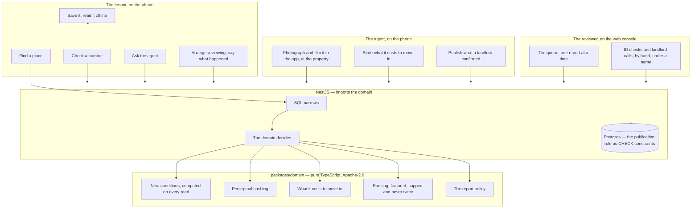
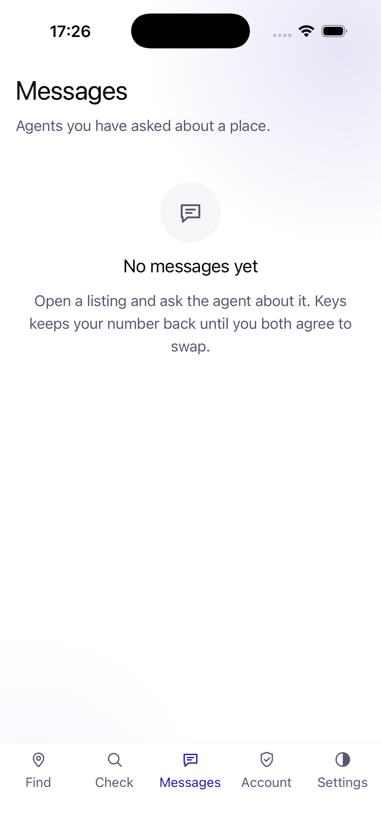
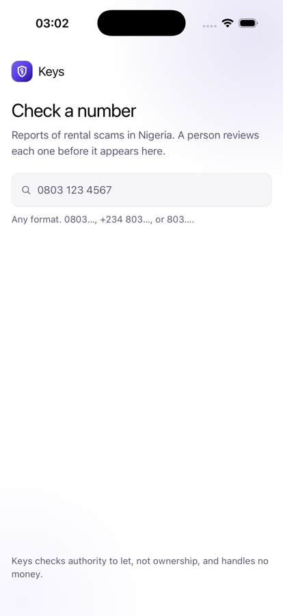
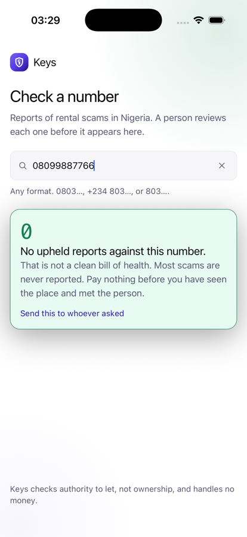
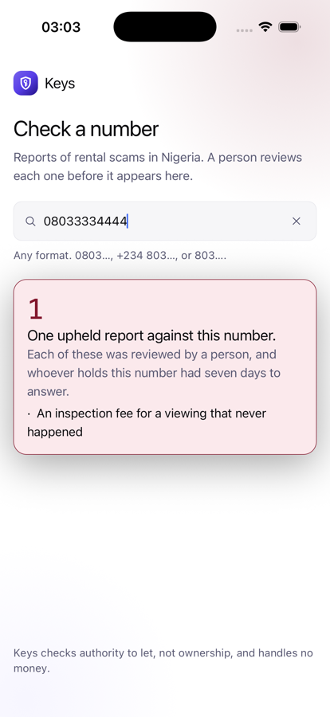
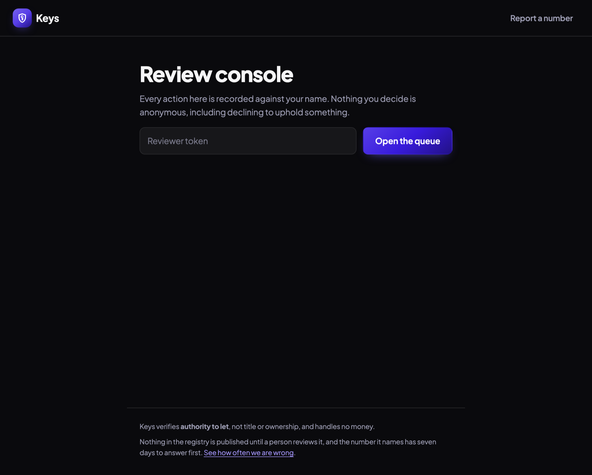

# Keys

Verified rental listings and tenancy management for Nigerian cities.

Keys attacks one thing first — *the listing is real* — and then follows the
tenant into the tenancy. The badge is nine conditions computed on every read
from evidence, never a stored flag; the phone number is the last thing
exchanged, not the first; and where v1.0 has no vendor, a person at Keys does
the work by hand and the product says so.

| Find a place | What it costs to move in | What was checked |
|---|---|---|
|  |  |  |

---

## 1. The problem

Finding a place to rent in Lagos, Abuja or Port Harcourt costs money before
it costs rent. You see a listing, you call, you pay an inspection fee — and
then the property does not exist, or was let three months ago, or the person
showing it has no authority to let it. You have spent ₦10,000 and half a day.
You repeat this ten times.

The inspection fee is not a cost of finding a house. For a meaningful number
of operators, **it is the entire business model** — because the fee is
collected before the property is seen.

> **The scarce commodity is not listings. It is the belief that a listing is
> real.**

Nigerian property portals have enormous inventory and near-zero trust. Adding
more listings adds nothing. The whole opportunity is making a *smaller,
verified* inventory credible — and the honest consequence is that Keys
launches with far fewer listings than the incumbents and must be comfortable
with that. The mechanism is inverting the incentive on inspection fees: Keys
takes no cut of them, so a listing that generates fees without ever producing
a let is worthless to Keys and profitable to a portal.

### The wedge

**A free, public, no-account scam registry.** Paste a phone number and find
out whether it has been reported. That is useful on day one to someone who
found the property on Facebook, with zero listings and zero agents on the
platform. It also solves the hardest problem in a two-sided property
marketplace: agents come to Keys to *defend a clean record*, so onboarding is
partly self-driven rather than entirely sales-driven.

### What it is not

**Keys verifies authority to let, not title or ownership.** It is not a
guarantor, and it handles no money — no escrow, no rent collection, no
deposit holding. The schema itself has no transaction columns.

**Nothing is published about a person until a person upheld it.** A report
against a phone number is public only after a named reviewer read it and said
why, and the accused answers with a texted capability, not an account
([ADR-0002](docs/adr/0002-nothing-is-published-until-a-person-upheld-it.md),
[ADR-0003](docs/adr/0003-the-accused-answers-with-a-texted-capability-not-an-account.md)).
Legal review of that policy blocks public launch outright (R3), and no test
result substitutes for it.

**The rules exist once.** The server imports the domain rather than mirroring
it, so a rule cannot drift because there is only one of it
([ADR-0001](docs/adr/0001-the-server-imports-the-domain-rather-than-mirroring-it.md)).

---

## 2. How it works



### How a listing is verified

[Nine conditions](packages/domain/src/listings.ts), and the badge is the
statement that every one of them holds. It is computed on every read — there
is no `is_verified` column — so a listing that loses one is gone from the
*very next* search rather than the next sweep. Six independent mechanisms
behind them, so defeating one does not defeat the system:

1. **Geotagged on-device capture** — a photo *and* a walkthrough taken in-app,
   within 200 m of the stated address, signed by a key the phone cannot
   export and verified server-side. EXIF is not trusted; it is trivially
   forged.
2. **Perceptual hashing** — every image compared against every image ever
   uploaded, across agents, cities and time. Recycled photographs are the
   signature of a fake listing.
3. **Proof of authority** — a landlord confirms the agent. At v1.0 that is a
   reviewer telephoning them and recording what was said under their own
   name; the texted code is written and waits on an SMS provider.
4. **Forced 14-day confirmation** — a deliberate per-listing action. There is
   deliberately **no bulk-confirm**: the friction is the feature.
5. **What it costs, stated** — a listing that has not said what it costs to
   move in is not Verified. An explicit zero is a claim an agent can be held
   to; silence is not.
6. **What happened when somebody went** — *there was nothing there*, from a
   tenant whose viewing this agent agreed to, suspends the badge at once. The
   remedy is a fresh signed capture at the property: ten minutes for an agent
   who has the flat, impossible for one who never did.

### SQL narrows; the domain decides

Search is fast without SQL answering any of the questions it makes fast. A
bounding box — computed from the *furthest* edge, deliberately too big,
because a box a few metres too narrow silently loses a result nobody can
tell is missing — and a substring match narrow the rows; the domain ranks
them, prices them and computes the badge. **Nothing narrows on
verification**: SQL may narrow on what a listing *says*, never on what Keys
*concluded*. No PostGIS, because `ST_DWithin` would be a second
implementation of distance; no full-text search, because a `tsvector` and
`matches()` would return different sets for a query somebody is halfway
through typing, and every suite runs against both stores precisely so that
passing in memory is evidence about production.
[ADR-0008](docs/adr/0008-sql-narrows-the-domain-decides.md).

### Where v1.0 has no vendor

Fifteen release gates were open and one was closed, and nine of the fifteen
could not be closed by any amount of code. [`docs/V1-SCOPE.md`](docs/V1-SCOPE.md)
does the only thing that shortens the list: it says what v1.0 is without any
of them. A person at Keys telephones the landlord, looks at the ID document,
and records what they found under their own name. Not a stub, not a mock, and
not a feature quietly disabled — slower, unscaled, and exactly what the
roadmap committed to when it said *Lagos-only launch paced to review-console
capacity*.

---

## 3. The app

Twenty-four screens across four faces — tenant, agent, landlord, reviewer —
one app and a web console, four languages, both themes. The full deck with
the reasoning under every screen is
[`docs/Keys-screens.pdf`](docs/Keys-screens.pdf).

### Finding a place

| Find a place | What it costs to move in | What was checked |
|---|---|---|
|  |  |  |

**Checked places only, by default.** Turning that off is a deliberate act,
and what comes back then still says, per listing, that it has not been
checked. A product whose default is *show me everything* has a badge nobody
has any reason to earn.

Each row is priced by what it costs to **move in**, not by the advertised
rent. Two flats advertising ₦800,000 are not the same price, and a list
showing only rent hides exactly the difference somebody opened the app to
compare. The breakdown is the second screen: ₦800,000 advertised, ₦1,100,000
to move in, and a fee above the customary ten per cent named as such where
the reader is already looking.

The third screen is the one the product is about. Not a badge and not a
score: the nine conditions, ticked or not, in the reader's own language,
**recomputed on that request from evidence**. A tenant can read the list and
disagree with it, which a badge does not allow.

### Talking to an agent

| Asking about a place | Messages |
|---|---|
|  |  |

**The number is the last thing exchanged, not the first.** The default in
every Nigerian property listing is a phone number in the advert, and
everything bad follows from it: enquire about one flat and you are called
about six others for a year. Keys holds both numbers back until each side
offers theirs, and a message with a number in it is *refused* rather than
quietly stripped — somebody who thinks they sent their number waits for a
call that never comes.

The account is part of the question rather than a gate in front of it.
Somebody who has found a flat has a reason to give a name; somebody who has
just opened the app has none. The number is hashed on arrival and no agent
ever sees it — said on the screen that asks for it, where somebody wonders.

### The registry

| Lookup | Nothing upheld | Upheld |
|---|---|---|
|  |  |  |

Paste a number; no account. *Nothing upheld* is a real answer and is worded
so it cannot be read as *clean*. An upheld report shows the reviewer's
reason and the accused's reply beside it. Unreachable says unreachable — a
phone with no signal has checked nothing.

### The agent's side, and the web

| Your account | The review console |
|---|---|
|  |  |

What a tenant sees when they check this number, first — before the
properties, because that is the thing an agent is actually building. An
agent photographs and films the flat in the app, signed by a key the phone
cannot export, states what it costs, and publishes only what a landlord has
confirmed. Every upload says what it will cost in data before it spends it.

The web is the registry surface: the lookup, reporting, the right of reply,
the review console and the transparency figures. Geotagged capture is
deliberately impossible on web — that limitation *is* the guarantee: a
verified listing requires that a person physically stood at the property.

### The tenancy

Phase 7, built ahead of v1.0 shipping. From the Messages tab a tenant opens
*Tenancy*; from the Account tab the letting side opens *Your tenancies*. Both
read the same record ([ADR-0010](docs/adr/0010-the-tenancy-has-two-parties-and-the-letting-side-is-an-agent-account.md)).

**The agreement** is a versioned template with blanks — the property, the
parties, the rent, the period, the deposit, the start — and each party signs
its bytes with the same phone key that signs a capture; signed by both, it
is in force. Until a lawyer has read the template the screen says so, in
every language, and that Keys gives no legal advice (R17).

**The schedule** is what the agreement implies, one period at a time. The
letting side **records** a payment as received; the tenant sees it at once
and may say *this is not right*; a wrong amount is **corrected** by a new
entry with a reason, never edited, and the receipt carries the correction
rather than hiding it. Every receipt says that Keys recorded this and did
not receive, hold or move the money — and a gate fails the build on any
sentence in any language that would imply otherwise
([ADR-0009](docs/adr/0009-a-tenancy-records-money-and-never-touches-it.md)).

**Maintenance** is an append-only history: the tenant raises, the letting
side acknowledges, assigns, works and resolves, the tenant closes or
reopens; the edges are data a test asserts exactly, and a screen offers only
the moves its side may make. Nothing is deleted.

**The condition record** is Snag's walk on a Keys phone: a template names
the rooms, a prompt starts a caption, every photograph is hashed the moment
it is taken, *fine* is a real answer. A draft either side may change; a
record both have signed nothing changes. At move-out the same rooms are
walked again and the app shows what changed, per room, as a list — never a
number ([ADR-0011](docs/adr/0011-the-condition-record-is-snags-and-is-acknowledged-by-both-or-by-neither.md)).

**The portfolio** is one row per tenancy — the next due, what is recorded
against it, periods short, tickets waiting — and never a total across them.

### Depth and reach

Phase 8, built ahead of v1.0 and v1.1 shipping. **Three cities** — Lagos,
Abuja, Port Harcourt — as data with their named areas; a listing belongs to
the city whose box contains it and to the nearest named area, and a search
in Abuja returns only Abuja
([ADR-0016](docs/adr/0016-a-city-is-data-and-a-listing-belongs-to-one-by-its-coordinates.md)).

**Distance, never a time.** A tenant picks a place they go often from the
city's areas and a radius; every row says *4.2 km from Marina*, and no
screen, response or source file says minutes — a test greps for the word
([ADR-0013](docs/adr/0013-a-commute-is-a-distance-and-never-a-time.md)).

**An area guide is what tenants answered.** Four questions with fixed
answers — power hours, water source, how to get there, how far a daily
market — answered by tenants who hold a tenancy in the area, once per
tenancy, latest answer counting; shown only once five separate tenants have
answered, as counts and never a verdict, with no person and no date finer
than a month in it
([ADR-0014](docs/adr/0014-an-area-guide-is-what-tenants-answered-shown-only-above-a-floor.md)).

**An application is the tenant's own words.** Occupation, household, when
they can move, a note — to one agent for one listing. Keys adds two facts
the tenant sees on their own screen and computes nothing: no score, no
ratio, no field named risk, and no reason field on a decline, because a
reason field becomes a discrimination record. The status is a closed list
the tenant sees every change of
([ADR-0015](docs/adr/0015-an-application-is-the-tenants-own-words-and-keys-scores-nobody.md)).

360° tours need a camera the simulator does not have, and are R18.

### At the largest text size

| iOS accessibility XXXL |
|---|
|  |

Checked rather than assumed. At this setting the tab bar had been wrapping to
three lines and taking forty per cent of the screen, listing titles truncated
to "Two bedroom flat, Ya…", and the cost breakdown collapsed to one word per
line beside a figure with the rest of the screen to itself. **None of that
overflowed in a way an automated check would have caught.** It was simply
unreadable, and only looking found it.

---

## 4. What each layer does

### `packages/domain` — the rules, once

Pure TypeScript, no build step — Node runs it directly — and a boundary
lint proved to fire keeps every platform import out. Listings and the nine
conditions, capture and its signature, perceptual hashing, what it costs to
move in, places and distance, search and ranking, featured placement (Verified
only, matching the query by the shape of the function, capped at three, never
twice), conversations and the number rule, inspections, saved listings and
what one is allowed to claim, reports and the policy, phone normalisation,
and the four languages. Three consumers — the phone, the web, the server —
and one implementation.

### `apps/server` — NestJS, and what it refuses

NestJS 11 on Node 22. Every store has an in-memory implementation and a
Postgres one, and every suite runs against both. The publication rule is a
`CHECK` constraint as well as a domain rule, because a rule this serious
lives in three places
([ADR-0005](docs/adr/0005-a-rule-this-serious-lives-in-three-places.md)).
Every reviewer decision names a person
([ADR-0006](docs/adr/0006-a-reviewer-is-not-an-answer-to-who-decided-this.md));
an unconfigured console refuses everybody; `*` in CORS will not boot. The
OpenAPI document is emitted from the controllers and `packages/api` is
generated from it, gated against drift.

### `apps/mobile` — React Native, and the two native modules

RN 0.87 on the New Architecture. `KeysSecrets` is a Keychain module with
`AfterFirstUnlockThisDeviceOnly`, so a rebooted phone does not sign anyone in
until it is unlocked; the capture module signs with a key the phone cannot
export. Android's `available()` reports false where there is no module and
sign-up is refused rather than a token kept in a file. Every string a screen
renders goes through `say()` in four languages, and a gate reads the bundle a
device would run to prove they are in it.

### `apps/web` — Next.js, the registry surface

Server-rendered lookup, report, reply, review and transparency pages, drawing
the same mark from the same path as the app. `KEYS_API_URL` has no localhost
fallback, deliberately.

---

## 5. Quick start

```bash
make setup                 # pnpm install, the local databases, and the git hooks — once
make ci                    # every gate and every test
```

The server, with a reviewer token long enough for the guard to accept:

```bash
KEYS_REVIEWERS="ada:$(openssl rand -hex 24)" PORT=5211 pnpm --filter @keys/server start
```

Without `KEYS_DATABASE_URL` it starts on an in-memory store and says so —
`/healthz` answers `durable: false`. That fallback announces itself rather
than defaulting the other way, because a server that quietly loses every
report on restart while every log line looks normal is worse than one that
will not start.

```bash
make db     # createdb keys_test and keys_dev, once
KEYS_DATABASE_URL="postgres://$USER@localhost/keys_dev" \
KEYS_REVIEWERS="ada:$(openssl rand -hex 24)" PORT=5211 \
  pnpm --filter @keys/server start
```

The app, once per machine, for iOS:

```bash
cd apps/mobile/ios && LANG=en_US.UTF-8 pod install
```

The web surface, pointed at the server:

```bash
KEYS_API_URL=http://127.0.0.1:5211 pnpm --filter @keys/web dev
```

### Configuration

Every one of these changes what the server will *refuse* to do, which is why
they are listed together.

| Variable | Read by | Unset means |
|---|---|---|
| `KEYS_DATABASE_URL` | server | In-memory store. Announced: `/healthz` says `durable: false` |
| `KEYS_REVIEWERS` | server | `name:token,name:token`. Resolves a token to the reviewer who holds it, so every audit row names a person |
| `KEYS_REVIEWER_TOKEN` | server | The older single-token form; resolves to a reviewer called `unattributed`. With neither set **the console refuses everybody**. Tokens shorter than 32 characters are refused |
| `KEYS_CORS_ORIGINS` | server | No browser may call the API. `*` is rejected at startup |
| `KEYS_MEDIA_DIR` | server | The in-memory media store, which says `durable: false` |
| `KEYS_API_URL` | web | **The web surface will not start.** No localhost fallback |
| `KEYS_TEST_DATABASE_URL` | tests | Server suites run against the in-memory store only, and `make test` prints a warning saying so |

The agent's phone key that signs a capture also signs an agreement and a
condition record; a tenant registers the same phone key once
(`/v1/tenants/me/key`) and signs with it. Every signature is verified on the
server over bytes the server handed out.

Each default is the one that fails loudly. A missing secret should stop the
thing that needs it, never quietly widen what is allowed.

---

## 6. Correctness notes

The parts that were harder than they looked, and the bugs that reached a
green suite.

### Three gates that could not fail

When phase 1 began, three of the gates had been ported from the previous
project and were scanning directories that do not exist here, or returning
zero unconditionally. Green, and proving nothing. Every gate now fails when
it examines nothing, and the rule is
[ADR-0004](docs/adr/0004-a-gate-that-cannot-fail-is-not-a-gate.md). It has
been cited ten times since, most of them against a test written the same
hour: a `beforeAll` that set `KEYS_REVIEWERS` and never unset it left the
unattributed-reviewer refusal unreachable; a restart gate read
`capture_nonces` directly and stayed true with the store switched back to
memory; a test "published" a listing under an invented `propertyId` that
`publishListing` silently refuses, and asserted about a draft.

### The migration left the token behind

The Keychain migration read the Keychain, found the token already there, and
returned early — never deleting the file copy. The write and the delete are
not one operation: a phone killed between them, or one failed delete, would
keep a readable token in the container for ever while the function reported
success. It sweeps on every launch now, which is cheap and is the only
version that converges.

### A test had been deciding the schema

`duplicate_pairs` takes listing ids, so its columns are `uuid` — and a
phase-4 test passed the literal `'somewhere-else'`, which the memory store
accepted happily. The tempting fix was to widen the column to `text`. The
right one was to give the test a real second listing. The database refused
another first row the same week: `evidence_attestor_matches_kind` had never
heard of `keys`, and the constraint was right — rewritten rather than
dropped, because that pairing is what stops a landlord "confirming" an
identity.

### The saved copy said two things at once

The listing page rendered the saved copy and a "we cannot reach Keys" panel
underneath it — two accounts of the same situation. And the *Checked places
only* chip stayed lit above the saved list: a filter about a live search,
sitting over a list of copies, claiming Keys had filtered them to checked
places, which is the claim the card on each of those pages spends a paragraph
carefully not making. A saved listing never shows the badge, not even one
saved thirty seconds ago, because a phone with no signal has checked nothing.

### `rank()` was never told that featuring exists

No parameter, no field on a scored listing — asserted on the *signature*,
because asserting on behaviour would only prove that today's `rank` ignores
an input it could be given tomorrow. `featuredAmong` takes the already-ranked
results, so a paid slot cannot show a flat in Ikeja to somebody searching
Surulere.

### `TurboModuleRegistry.get` returned null for a module in the binary

`get` is the method whose signature says "null when absent", and it resolved
nothing, next to two modules registered the same way that resolve fine. These
are legacy `RCT_EXTERN_MODULE` modules reached through the bridgeless interop
layer, which is consulted on the *enforcing* path. So: `getEnforcing` in a
try/catch, with the catch as the platform check — the second time this
codebase lost time to how these modules are reached rather than to what they
do.

### A gate with a hole, written into the file

A phrase used only by a component that nothing mounts counts as used —
`wired-check` exempts components deliberately, and the two exemptions line up
to leave a gap that `waiting_to_send` survived. Named in the source so nobody
trusts the check further than it goes. A test went stale the same way: a
hand-written list of phrase names, maintained separately from what exists,
failed when one was correctly deleted; it derives its own list now.

---

## 7. The documentation pipeline

Six documents move as the work moves, and a gate in
[`scripts/doc-check.sh`](scripts/doc-check.sh) runs in `make ci`.

| Document | Answers | Updated |
| --- | --- | --- |
| [`docs/JOURNAL.md`](docs/JOURNAL.md) | What did we do, and what surprised us? | Every session |
| [`CHANGELOG.md`](CHANGELOG.md) | What changed for someone using this? | Every user-visible change |
| [`docs/adr/`](docs/adr/) | Why is it built this way? | Any non-obvious decision |
| [`docs/ROADMAP.md`](docs/ROADMAP.md) + `PHASE` | Where are we, and what finishes this phase? | When a gate goes green |
| [`docs/RELEASE-GATES.md`](docs/RELEASE-GATES.md) | What blocks v1.0, and what would clear it? | When a gate is added or closed — a gate blocks the next phase or the release, never neither ([ADR-0007](docs/adr/0007-a-gate-blocks-the-next-phase-or-it-blocks-the-release.md)) |
| [`docs/V1-SCOPE.md`](docs/V1-SCOPE.md) | What is v1.0 without a vendor? | When the gate list grows |

`doc-drift` fails when the screens document no longer describes the screens;
`phrase-check` when a phrase in the table is rendered by nothing;
`api-fresh` when the generated client no longer matches the controllers.
[`docs/Keys-screens.pdf`](docs/Keys-screens.pdf) is the deck with the
reasoning under every screen, and
[`docs/TOOLCHAIN.md`](docs/TOOLCHAIN.md) is what this machine has.

---

## 8. Data handling

Keys makes claims about other people, so what it holds is the part that
matters most.

| Class | Examples | Rule |
| --- | --- | --- |
| Hashed on arrival | Every phone number — the tenant's, the agent's, the reported one | No agent ever sees a tenant's number; the outbox holds a hash and nothing else |
| Never exchanged until offered | Phone numbers in conversation | Held back until each side offers theirs; a message with a number in it is refused, not stripped |
| Named, always | Who upheld a report, who checked an ID, who called a landlord | Every audit row resolves to a reviewer; an unconfigured console refuses everybody |
| Signed on the device | Captures — the greyscale grid, the media, the position | A key the phone cannot export; EXIF is never trusted |
| In the Keychain | Session tokens on iOS | `AfterFirstUnlockThisDeviceOnly`; swept from the container on every launch. Android refuses an account rather than keep one in a file |
| Never stored | The badge | Nine conditions computed on every read; there is no `is_verified` column |
| Never held | Money | No escrow, no rent, no deposit; the schema has no transaction columns. A tenancy *records* a payment as received and a gate keeps *pay*, *wallet* and *balance* out of every language |
| Signed by both or by neither | The agreement, the condition record | Each party's phone key over the same bytes; one signature is a draft |
| Appended, never edited | Payments, corrections, disputes, ticket events | A wrong amount is corrected by a new entry with a reason; the receipt says so |
| Public only when upheld | A report against a number | Published by a named reviewer with a reason; the accused answers by a texted capability |
| Never computed | Anything about a tenant | An application is their own words plus two facts they can see; no score, ratio or risk exists in the schema or the source, by test |
| Never a person | An area guide | Counts of answers above a floor of five, a month and no finer, no account id in what is served |
| Never stored | The place a tenant named | Travels with the search as a point and is kept nowhere |

---

## 9. Development

```bash
make ci            # every gate, then the tests
make gates         # the blocking checks alone
make test          # 179 domain, 258 server against both stores, 23 app, 4 wire
make api           # regenerate packages/api from the controllers
make palette       # regenerate the palette; palette-check fails if it drifted
```

`make setup` points git at `.githooks`, so `make ci` runs before every push.
`--no-verify` skips it, deliberately: a hook that cannot be skipped is a hook
people delete.

Sixteen gates, every one **proved to fail** by breaking what it guards and
watching it go red:

| Gate | Holds |
|---|---|
| `typecheck` | Four packages, TypeScript strict, `exactOptionalPropertyTypes` |
| `lint` | ESLint across every package |
| `boundary` | `packages/domain` imports nothing platform-specific |
| `doc-check` | Required documents exist, are tracked, and the roadmap marks the phase `PHASE` says |
| `doc-drift` | The screens document still describes the screens |
| `wired-check` | Nothing is exported, tested, and called by nothing |
| `untranslated` | No English string is rendered by a screen without going through `say()` |
| `phrase-check` | No phrase in the table is rendered by nothing |
| `repo-check` | No build output is tracked |
| `api-fresh` | The generated client still matches the controllers |
| `bundle-check` | **The app actually bundles**, and all four languages are in the artefact a device runs |
| `splash-check` | The native launch screen and the JavaScript splash are the same colour |
| `mark-check` | The app and the web draw the same mark, to the path |
| `palette-check` | The generated palette is what the tokens produce |
| `copy-check` | Any sentence, in any language, implying Keys holds, moves or asks for money — proved to fire on *pay now to secure your deposit* |
| `test` | Every suite; the server's against every store implementation |

The server suites run **against every store implementation** — in memory
and Postgres — because a suite that only exercises the `Map` proves
something about a `Map`. `make test` finds a database if one is reachable
and says plainly when it cannot.

### Before a feature is called done

- The rule is in `packages/domain`, once, and tested there
- The server suite for it runs against both stores and passes on both
- Every string a screen renders is in the table, in four languages
- 200% text scaling without truncation — checked, not assumed
- Any new gate is added to the ledger as blocking a phase or the release
- An ADR for any non-obvious decision; `CHANGELOG.md` and the journal updated
- `make ci` green

---

## 10. Layout

```text
packages/domain/src/       listings and the nine conditions, capture, hashing, money,
                           places, search, featured, conversations, inspections, saved,
                           reports, phone, language; tenancy, maintenance, condition,
                           portfolio; cities, distance, guides, applications —
                           pure TypeScript, Apache-2.0
packages/api/              the wire client, generated from the controllers, gated
apps/server/src/           NestJS: agents, captures, market, outbox, reports, tenancy,
                           reach, health; every store in memory and in Postgres
apps/server/test/          one file per rule, each run against both stores
apps/mobile/src/screens/   the nineteen screens: the tenancy's four, applying, applications,
                           telling others about your area
apps/mobile/src/native/    KeysSecrets (Keychain) and the capture module
apps/mobile/src/design/    the tokens and the generated palette
apps/web/                  Next.js: lookup, report, reply, review, transparency
design/                    the mark and the palette source
docs/screens/              the twenty-four screens the README and the deck show
docs/adr/                  the eight decisions
docs/V1-SCOPE.md           what v1.0 is without a vendor
scripts/                   the gates
```

---

## 11. Status

**Phase 6 of 8 — launch hardening.** `PHASE` holds the number,
[`docs/ROADMAP.md`](docs/ROADMAP.md) holds the phase gates, and
[`docs/V1-SCOPE.md`](docs/V1-SCOPE.md) says what v1.0 is. **Nothing is
deployed, and five gates block v1.0** — every one of them needs a physical
device or a person, not more code.

**211 domain tests, no build step; 276 server tests, every suite against
in-memory and real PostgreSQL including a process restart; 23 app tests;
4 wire tests.**

| | |
|---|---|
| Mobile | React Native 0.87, New Architecture, TypeScript strict |
| Web | Next.js 15 with SSR — the registry surface |
| Server | NestJS 11 on Node 22, importing the same rules the phone runs |
| Data | PostgreSQL 16, the publication rule as `CHECK` constraints; no PostGIS, deliberately |
| Faces | tenant, agent, landlord, reviewer — one app and a web console |
| Screens | 24, four languages, both themes |
| Conditions behind the badge | 9, computed on every read, never stored |
| ADRs | 16 |
| Gates | 16, each broken on purpose to prove it fires |

| Phase | State |
| --- | --- |
| **0** Foundation | Done |
| **1** The scam registry — the wedge | Gate green — lookup, report, right of reply, the console, transparency |
| **2** Agent verification and authority | Gate green — ID checks and landlord confirmation by hand, under a name |
| **3** Listing integrity — the technical core | Gates green — signed capture, perceptual hashing, the nine conditions |
| **4** Search and discovery | Done — SQL narrows, the domain decides; nothing is cached |
| **5** Marketplace loop | Done — asking, messaging, viewings, *there was nothing there* |
| **6** Launch hardening | **current** — the Keychain, offline saved listings, the largest text size; the gates are devices and people |
| **7** Tenancy → v1.1 | Built ahead — the agreement signed by both, the schedule and what was recorded, receipts that carry their corrections, tickets as history, the condition record, the portfolio; the gate is a lawyer reading the template (R17) |
| **8** Depth and reach → v1.2 | Built ahead — three cities as data, distance from a named place and never a time, area guides above a floor of five, applications without a score; 360° tours need a camera (R18) |

### What is open, and why it matters

| Open | Blocks | Why it is not closed |
| --- | --- | --- |
| A photograph taken on a real phone at a real property | v1.0 (R11, R14) | There is no photograph anywhere in this product yet: a capture is a 40×32 greyscale grid, enough for every gate here and not enough to look at the flat. A simulator has no camera |
| An Android build somebody has watched succeed | v1.0 (R4, R16) | Never built on this machine; its session tokens have nowhere safe to live, so it refuses to open an account rather than keep one in a file |
| Review console throughput against real reports | v1.0 (R2) | A reviewer doing the job; the launch is paced to it |
| Legal review of the report policy | **Public launch, outright** (R3) | A Nigerian lawyer. No test result substitutes for it |
| An SMS a real phone received | v1.0 (R1, R7, R12) | The outbox holds only a phone *hash*, so no message in this product can currently be delivered to anybody |
| No KYC vendor, no payment provider, no bucket | Nothing, by decision (R6 closed by hand, R13, R15) | `docs/V1-SCOPE.md`: where v1.0 has no vendor, Keys does the work by hand and the product says so |

---

## 12. Licensing

Two licences, because the two halves have opposite jobs.

**The application is under the [Business Source License 1.1](LICENSE).** You
may run it in production to list, verify, let and manage properties belonging
to you or your clients. You may not offer Keys itself to third parties as a
hosted listing, verification or tenancy service. On **2030-08-29** it converts
to Apache-2.0 automatically.

**The rules are Apache-2.0**: [`packages/domain`](packages/domain/LICENSE).

That split is not symmetry. Keys makes public claims about other people —
that a listing is verified, that a phone number was reported — and **a claim
about somebody, decided by rules they may not read, is a claim with no
standing.** The verification logic and the report policy live in one
auditable package so that the person a claim is made about can check it.

---

Read [`CHANGELOG.md`](CHANGELOG.md) for what changed and why,
[`docs/ROADMAP.md`](docs/ROADMAP.md) for the eight phases and their gates,
[`docs/RELEASE-GATES.md`](docs/RELEASE-GATES.md) for what blocks v1.0,
[`docs/V1-SCOPE.md`](docs/V1-SCOPE.md) for what v1.0 is without a vendor,
[`docs/adr/`](docs/adr/) for the decisions, and
[`docs/00-PRODUCT-STATEMENT.md`](docs/00-PRODUCT-STATEMENT.md) for the full
problem analysis.
